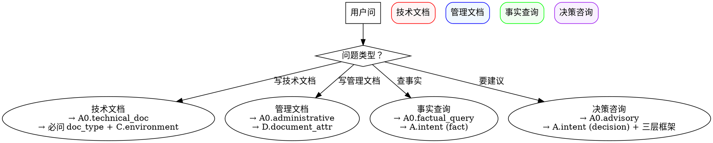

# Project Doc Overview（套件元说明 · 给模型读）

## ⚠️ 强约束: 不瞎编 (NO FABRICATION)

本套件所有 skill 严禁在执行过程中编造：
- 人名 / 日期 / 数字 / 工具名 / 角色签名表 / 文档状态 / 框架标签

详见 `../intent-clarification/references/no_fabrication.md` 与 `../intent-clarification/SKILL.md` 的 `<HARD-GATE: NO FABRICATION>` 段。

---

## 场景分流（必走 · 第一步）



> 目标对象：**模型**。模型加载本 skill 后应能自动：
> - 知道套件内 7 个 skill 各干什么、何时调
> - 知道**所有"问用户"必须先调 `intent-clarification`**
> - 知道 .project 目录结构与日志规范
> - 知道典型流程怎么编排

## Purpose

本套件用于管理**软件工程项目文档**（策划表、需求、设计、方案、测试、验收、部署、培训等）。
本 skill 是**模型读**的入口文档，不是用户文档。

核心原则：**确定的事由脚本完成，需要判断/确认的事由大模型完成**。

## Suite Roster（7 个 skill）

| Skill | YAML 描述（精炼） | 何时调 |
|---|---|---|
| `intent-clarification` | 统一澄清协议：scan 项目资料 → 展示已有信息 → 问用户 → 记日志 | **任何**需要和用户确认的场景（流程中可重入） |
| `project-doc-hub` | 调度入口：受理"项目+文档"请求 → 澄清 → 分派到 query/outline/write/data | 任何"项目+文档"请求的第一步 |
| `project-doc-query` | 回答项目事实/咨询：策划表/需求/方案/合同/邮件的事实 + 决策建议 | 用户问"项目里有什么""什么时候评审" |
| `project-doc-outline` | 生成 10 种文档类型的章节大纲（不含正文） | 用户要"先看大纲"或 hub 编排时 |
| `project-doc-write` | 基于已有资料填充正文 + 决策建议（不写评审稿/—占位） | 用户要"写完整文档" |
| `project-doc-workflow` | 4 步流水线检查清单（query→outline→write→落盘） | 端到端自动化场景 |
| `data-skill` | 业务文件 OCR → SQLite 入库 + 自愈核验（**独立子套件**） | 用户要"入库"数据 |

完整 YAML 描述见 `references/skill_yaml_descriptions.md`。

## Hard Rule: Every User-Facing Question Goes Through `intent-clarification`

模型在任何时候要问用户：
- 项目根目录、目标文档类型、意图（查询/生成/更新）
- 事实 vs 决策、项目相关 vs 行业通用
- 硬件/软件/网络/部署/等保/国产化/系统架构/国产化清单
- 文档状态/角色签名表
- 缺数据时主动问

**必须**先调 `intent-clarification`，**禁止**在 SKILL.md / reference 里内联问。

## Process Files Location（关键：所有过程文件都在 .project/ 下）

```
<用户工作根>/.project/<项目号>/          ← 与项目目录平级（如 D:\项目文档\.project\202410-C0008\）
├── project_log.md                     ← 主操作日志（每个 skill 流程结束追加 1 条）
├── clarification_log.md               ← 澄清记录（每次 Q/A 追加 1 条）
├── drafts/                            ← 中间稿
└── session_<YYYY-MM-DD>.md            ← 会话日志（可选）
```

**Do NOT** create or modify files inside any skill for runtime records.

## Dispatch Decision Tree

```
用户说"项目+文档"相关内容
  │
  ├─ 涉及"入库/OCR/SQLite" → data-skill（独立子套件）
  │
  ├─ 涉及"生成/更新/写文档"
  │   ├─ hub 路径
  │   │   ├─ 纯查询 → hub → project-doc-query
  │   │   ├─ 仅大纲 → hub → project-doc-outline
  │   │   └─ 完整文档 → hub → project-doc-workflow → query→outline→write
  │   └─ 直达某个子 skill（用户已明确）
  │
  └─ 涉及"问用户" → 任何 skill 都先调 intent-clarification
```

## Anti-Patterns（模型严禁做）

| 反模式 | 后果 |
|---|---|
| 直接调 query/outline/write/data 而不调 intent-clarification | 5 处澄清不一致，重复问 |
| 在 SKILL.md 内联问"项目根目录是什么" | 违反统一协议 |
| 跳澄清直接给"应该/建议" | 违反 HARD-GATE |
| 模型自创"问用户的话术"绕过 intent-clarification | 协议失效 |
| 跨 skill 重复问相同问题 | 应读 `.project/<项目号>/clarification_log.md` |
| 把过程文件写在 skill/references/ 下 | 违反"过程文件外部化"原则 |
| 跳过 manage_project_log.py append-operation | 主日志缺失 |

## Typical Flows

详见 `references/typical_flows.md`。

### Flow A: 用户问"项目里有什么"
1. project-doc-overview（当前 skill）
2. → intent-clarification（取项目根 + intent + 范围）
3. → project-doc-query → 调 read_doc.py → 答案
4. → manage_project_log.py append-operation

### Flow B: 用户说"写个测试方案"
1. project-doc-overview
2. → intent-clarification（项目根 + 文档类型 + 意图）
3. → project-doc-outline
4. → intent-clarification（环境/技术/合规 10 个技术点）
5. → project-doc-write
6. → intent-clarification（数据完整性）
7. → 调"操作 word 的 skill"转 .docx
8. → 追加变更记录
9. → manage_project_log.py append-operation

### Flow C: 流程中再问（澄清可重入）
任何子 skill 任何步骤遇到新问题 → 调 intent-clarification → 记日志 → 继续。
