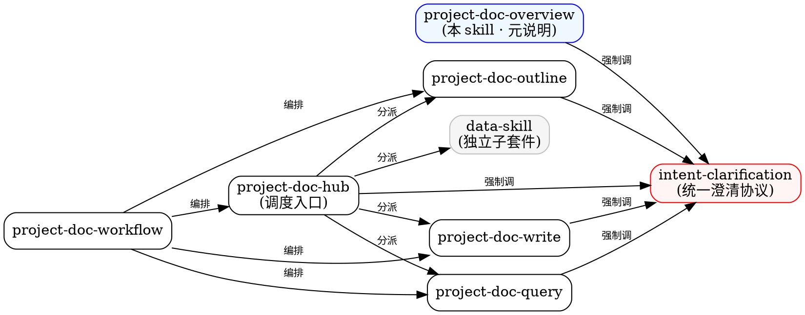

# Skill Dependency Graph（套件内 skill 依赖关系）

## 依赖规则

### 强依赖（必须调）
- **任何 skill** → `intent-clarification`（在需要问用户时）
- `project-doc-hub` → 各子 skill（按用户意图分派）

### 弱依赖（按需调）
- `project-doc-workflow` → `project-doc-hub`（编排时）
- 各 skill → `intent-clarification` 的具体 reference（按维度选）

### 不依赖
- `data-skill` 不依赖 `intent-clarification`（自行处理询问）
- 各子 skill 之间**不直接互调**（都通过 hub 编排）

## .project 目录写入规则

**任何** skill 流程结束后，**必须**调 `manage_project_log.py append-operation` 写一条到 `.project/<项目号>/project_log.md`。

**任何**澄清 Q/A 后，**必须**调 `manage_project_log.py append-clarification` 写一条到 `.project/<项目号>/clarification_log.md`。
